# Monitoring IOT Asset Data in Dashboards using Python

In this Code Pattern we will show how to publish IOT Asset Data from external sources (TRIRIGA Building Insights, Maximo) into the Watson IOT Analytics service.  The data will allow us to then monitor individual building energy consumption and compare the performance of different buildings. The monitoring dashboards allow us to visualize energy consumption trends over time.  This HTTP preload function could easily be modified to integrate to other IOT Platforms or data sources to allow you to quickly monitor your assets.

When the reader has completed this Code Pattern, they will understand how to:

* Understand how this Python function can load data into  [Watson IOT Platform Analytics](https://www.ibm.com/support/knowledgecenter/en/SSQP8H/iot/analytics/as_overview.html) from any REST Service
* Build a dashboard using [Watson IOT Platform Monitoring Dashboard](https://www.ibm.com/support/knowledgecenter/en/SSQP8H/iot/analytics/as_overview.html) to monitor, visualize, and analyze IOT asset data from external sources
<!-- [IBM TRIRIGA Building Insights](https://www.ibm.com/support/knowledgecenter/en/SSQP8H/iot/analytics/as_overview.html) -->
* Deploy, schedule and run these Python Functions in [Watson IOT Platform Analytics](https://www.ibm.com/support/knowledgecenter/en/SSQP8H/iot/analytics/as_overview.html) to retrieve data from Building Insights every 5 minutes.
<!-- * Define Assets in -->

The intended audience for this Code Pattern is application developers and other stakeholders who wish to utilize the power of Watson IOT Platform Monitoring Dashboard to quickly and effectively monitor any asset to ensure availability, utilization and efficiency.

<!-- 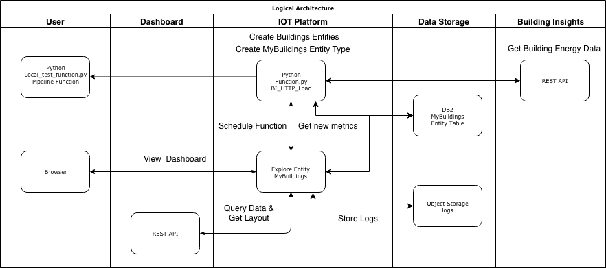 -->


#  Components

* [Watson IOT Platform Analytics](https://www.ibm.com/support/knowledgecenter/en/SSQP8H/iot/analytics/as_overview.html).   Sign up for an account [here](https://www.ibm.com/us-en/marketplace/internet-of-things-cloud/purchase)  An IBM Software as A Service that allows you to register devices, collect IOT Data and build IOT applications.

<!-- * [Building Insights](https://jupyter.org/):An IBM Software as A Service that allows you to manage your buildings. By using AI, Contextual Models, IoT and other sensor data, IBM TRIRIGA Building Insights consolidates, stores, and analyzes your data in real time, seamlessly improving building operations and giving you unique insights.   -->

* [Maximo](https://www.ibm.com/products/maximo).   Sign up for a free trial [here](https://www.ibm.com/account/reg/us-en/signup?formid=urx-20869)  An IBM SAAS offering that allows you to manage assets.

<!-- * [Monitoring Dashboard]() Code free dashboards that allow you to monitor a variety of types of assets.  Use out of the box cards to visualize timeseries data and other asset properties. -->

* [HTTPPreload](https://ibm.biz/BdzvyX) Python functions that allow you to collect IOT asset and sensor data from other IOT Platforms or data sources that can then be used to quickly monitor your assets in Watson IOT Platform Analytics.


# Flow

1. Setup your Python development environment
2. Create an Entity Type in Watson IOT Platform
3. Deploy function
4. Schedule the function to collect asset data
5. Create a Monitoring Dashboard to manage the asset
6. View the Monitoring Dashboard with Building Energy Consumption

# Prerequisites

* An account on IBM Marketplace that has access to Watson IOT Platform Analytics [here](https://www.ibm.com/us-en/marketplace/internet-of-things-cloud/purchase)

# Steps

Follow these steps to setup and run this Code Pattern.

1. [Setup your Python development environment](#1-setup-your-python-development-environment)
2. [Create an entity type](#2-create-an-entity-type)
3. [Deploy Function](#3-deploy-function)
4. [Import data to source](#3-deploy-function)
5. [Create a Dashboard](#4-create-dashboard)
6. [View Dashboard](#5-view-dashboard)
7. [Update Function](#3-update-function) (optional)

## 1. Setup your Python development environment

### Install Python
Mac comes with Python v2.7.9  recommend using Python v3.6.5 for using DB2. Launch Terminal

* Install Brew which is a package manager for Mac OS
```
/usr/bin/ruby -e "$(curl -fsSL https://raw.githubusercontent.com/Homebrew/install/master/install)”
```
* Change directory to your virtual environment
```
brew install python3
```
* Verify version of Python
```
python --version
```

### Install and Create a Virtual Environment
Launch Terminal

Install "pip". (Python Package Installer):
```
sudo easy_install pip
```

* Install virtual environment to keep dependencies separate from other projects
```
sudo pip install virtualenv
```

* Create a virtual environment
```
python3 -m venv env
```
<!-- virtualenv -p python3 env -->

### Activate Virtual Environment, Install Python Dependencies and Verify Environment
* Change directory to where you made a Virtual Environment
```
cd env
```
* Activate your virtual environment
```
source bin/activate
```
* The result in Terminal should be something like:
```
(env) My-Mac: myuserid$
```
* Install dependencies in from requirements.txt file on next:
```
git clone git@github.com:IBM/watson-analytics-dashboard.git
cd watson-analytics-dashboard

# Install dependencies
pip install numpy
pip install sqlalchemy pandas ibm_db_sa urllib3 requests lxml sklearn ibm_db python-dotenv future
pip install -r requirements.txt

# Install Watson IOT Functions
pip install git+https://github.com/ibm-watson-iot/functions.git@production --upgrade
```

<!-- * Apply fix for DYLD (OS X only)

```
# Navigate to your preferred python installation
cd /usr/local/lib/python3.7/site-packages

``` -->
<!--
* Install Watson IOT Functions dependencies:
```
pip install git+https://github.com/ibm-watson-iot/functions.git@production --upgrade
``` -->
* Set PYTHONPATH to your project directory:
```
export PYTHONPATH="<root_project_directory>"
```
<!-- * Verify that you can invoke the `local_test_of_function.py` script
```
python ./scripts/local_test_of_function.py
``` -->

## 2. Create an entity type

* Copy template.env and modify it to reflect your Maximo Credentials.
```
cp ./custom/template.env ./custom/.env
```
* Copy your Watson IOT Platform Service credentials into a `credentials.json` file
```
Navigate to your Watson IOT Platform Analytics service

https://dashboard-us.connectedproducts.internetofthings.ibmcloud.com/preauth?tenantid=<tenant-id>

Explore > Usage > Watson IOT Platform Analytics > Copy to clipboard
```
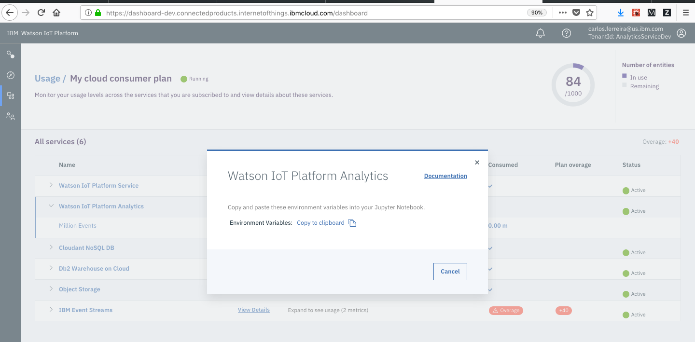

* Modify your .custom/functions.py to reflect your PACKAGE_URL to reflect your forked function Github repository:
```
PACKAGE_URL = 'git+https://github.com/fe01134/fun-bi@'

# Change the class name if someone else has already published a function with the same name in your tenant function catalog.

class MaximoAssetHTTPPreload(BasePreload):
```

* Invoke local_test_of_function.py. This script will create a "Buildings" Entity Type and execute the MaximoAssetHTTPPreload function to pull data from Maximo at a given interval:
```
python local_test_of_function.py
```

<!-- ```
python ./scripts/local_test_of_function.py
``` -->

## 3. Deploy Function
<!-- * Push function code changes to Github.
```
git add ./custom/functions.py
git commit -m "my function changes"
git push origin master
``` -->
Next, we'll add our custom function to our newly created entity. This will enable the function to run every 5 minutes and pull the latest meter readings. Navigate to the "Add Data view", and select the MaximoAssetHTTPPreload function

```
Explore > Entity Types > Buildings > Add Data
```
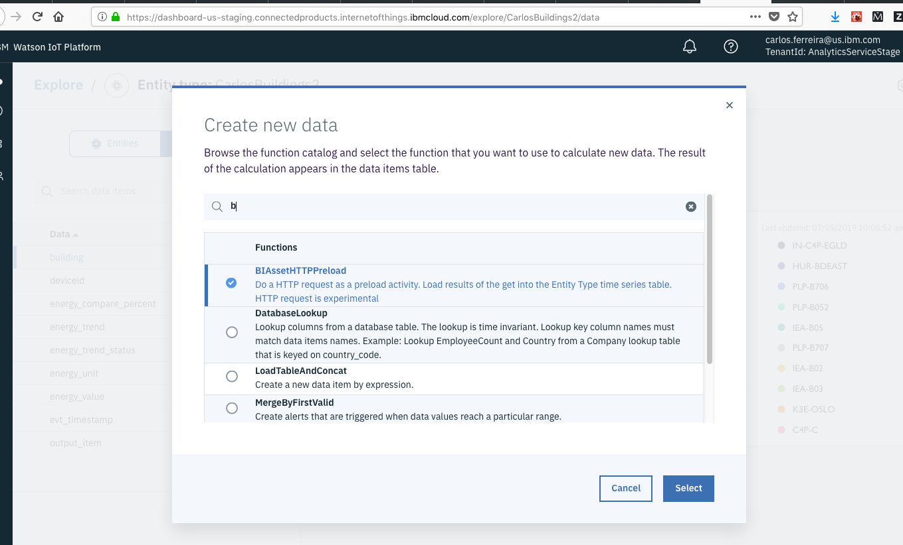

* Set values/credentials for your Maximo instance.
```
URL = <maximo_url>
username	= <username>
password = <password>
request = GET (select from drop down)
```
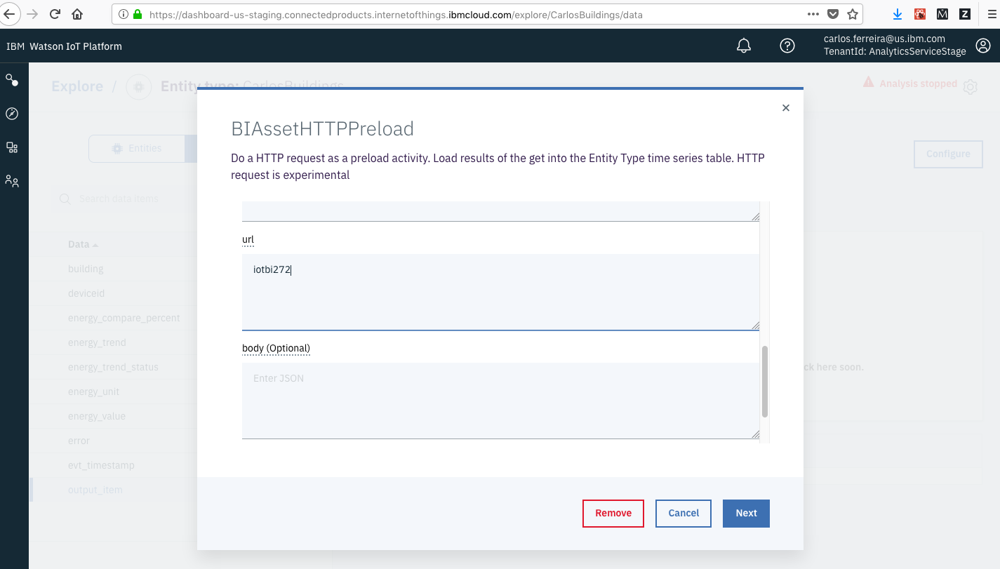

## 4. Populate data source
Here, we'll show how to add IoT data to a data source (Maximo). In this example, we'll use a Maximo instance. We'll begin by defining an "Asset Template". This will allow us to quickly generate multiple "Assets", which will represent buildings in this case. Access this form by searching for "Asset Templates" in the "Find Navigation Item" textbox in the upper left corner.

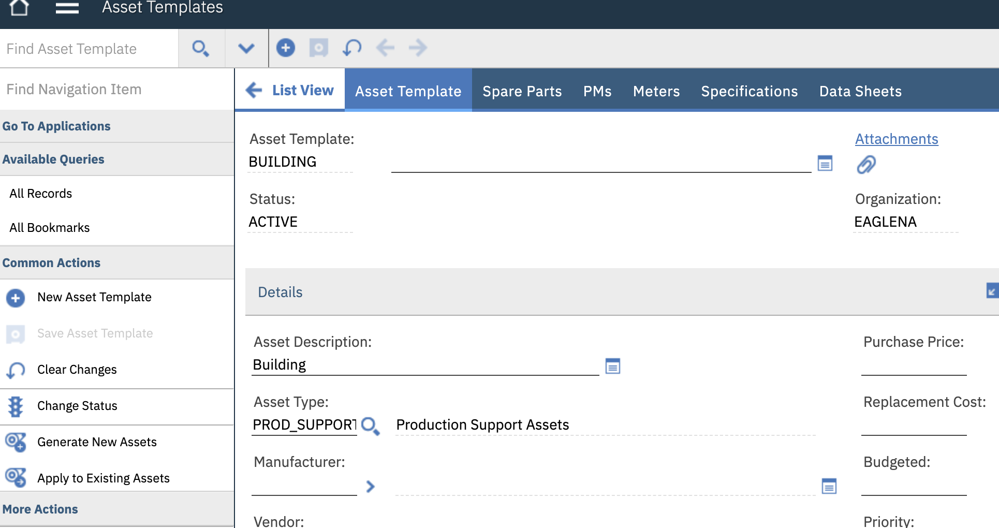

Each Asset can have multiple associated "Meters", which are used to track sensor readings over time. We'll add a "Temperature" meter and a "Energy" meter to our template.
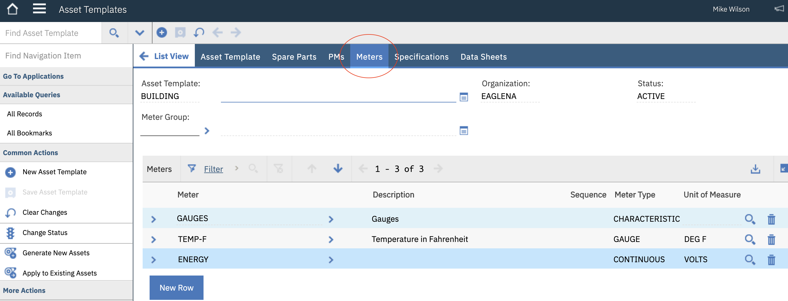

<!--  -->
Now that we have our asset template and associated meters defined, we can create a few building instances. We'll do this by clicking "Generate Building Assets". Provide a quantity and click "Ok".

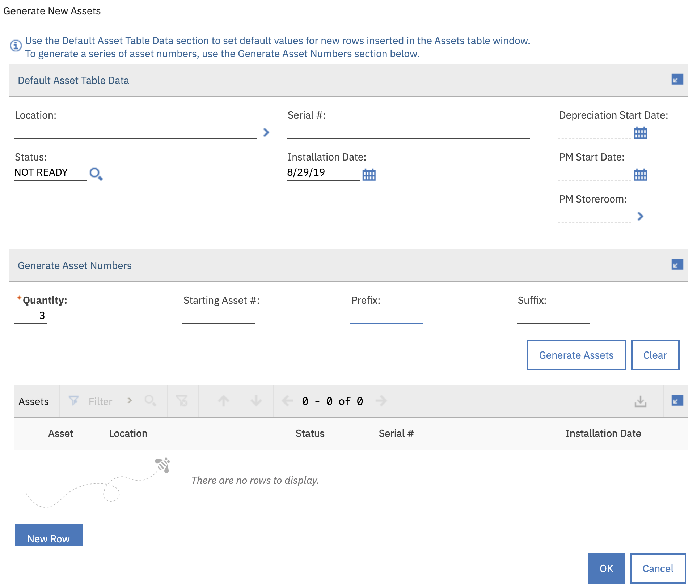

<!--  -->
After the building assets have been created, we can then look them up by clicking on "Assets" in the upper left menu. In the upper left "Find Asset" form, enter the number of one of the newly created assets.

Once the asset page loads, we can add data to the asset, select "Enter Meter Readings" in the lower left-hand menu, under the "More Actions" section. Provide values for the meters. In this example, be sure to add "temperature" values

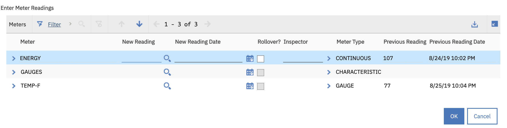

Confirm the meter values have be saved by clicking "Manage Meter Reading History"

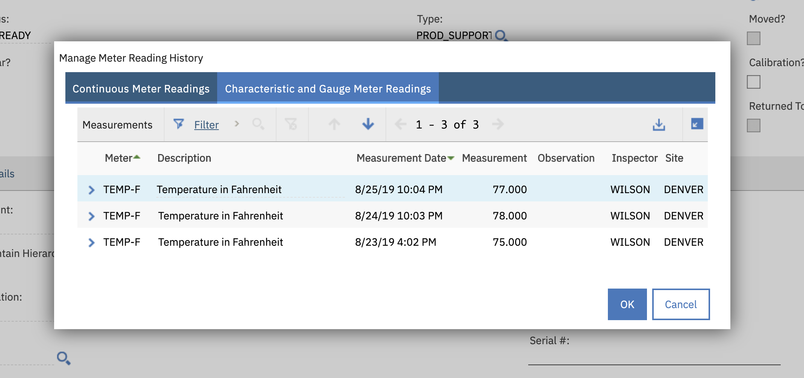

<!-- Now that we have some data populated in Maximo, we'll then samp -->


<!-- TODO, explain how to upload   -->

## 5. Create Dashboard
After populating our data source with sensor values, we can create visualizations in the dashboard

We can do this by clicking the "Explore" button on the left hand menu, and then selecting your recently created Entity

Then, click the gear in the top right > Manage dashboards
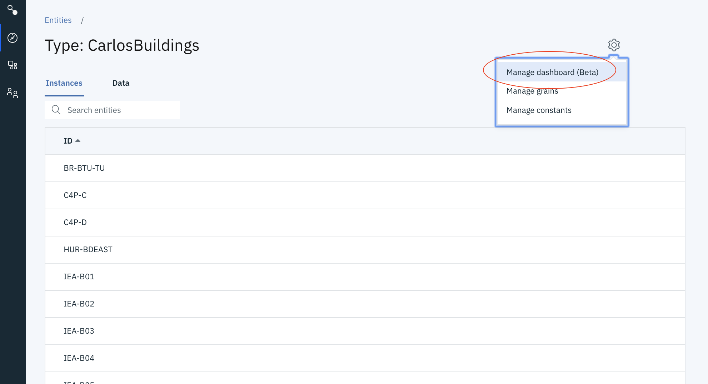

Next, click "Import"
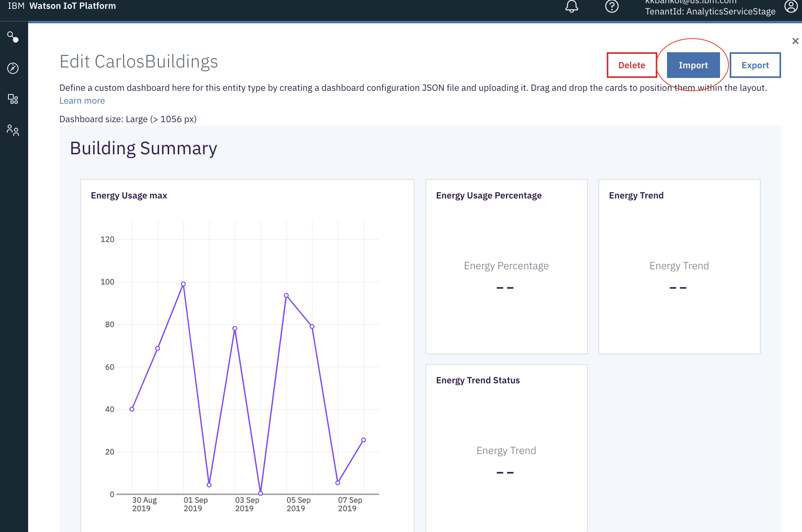

Select the file in the json directory of this project `./json/dasboardBuildingMaximo.json`

Click "Save"
<!-- * Import the dashboard layout file
```
Explore > Entity Types > Buildings > click gear top right > manage dashboards > import
``` -->


<!-- TODO, explain how to upload   -->

<!-- Choose file  ./json/Staging-Dashboard.json -->


## 6. View Dashboard

Finally, we can open the newly imported dashboard by clicking the "Explore" button on the left hand menu, and then selecting your newly created entity
<!-- * A new Dashboard tab should appear on each entity -->
<!-- ```
Explore > Entity Types > Buildings > select an entity which is one of your buildings > Dashboard
``` -->
<!--  -->


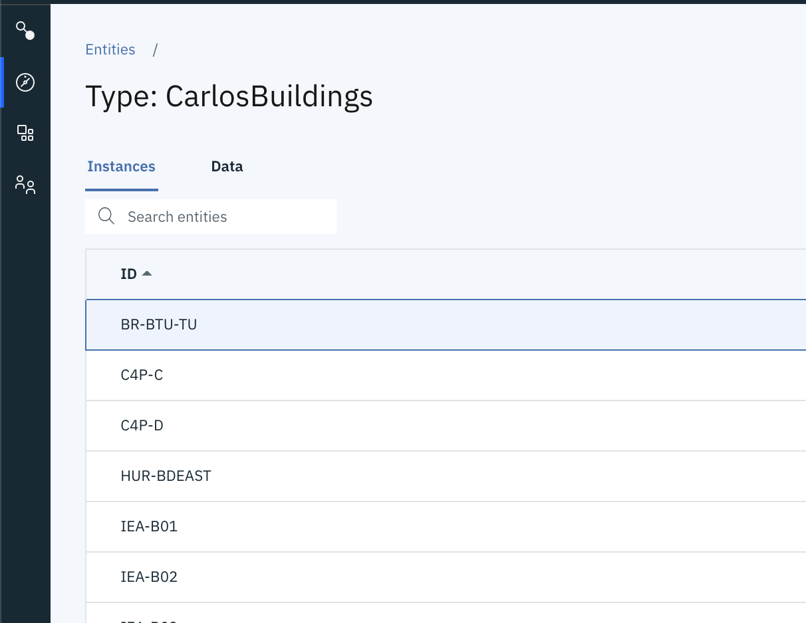


Next, select an instance from that entity


And the resulting view will generate a dashboard with the latest instance data
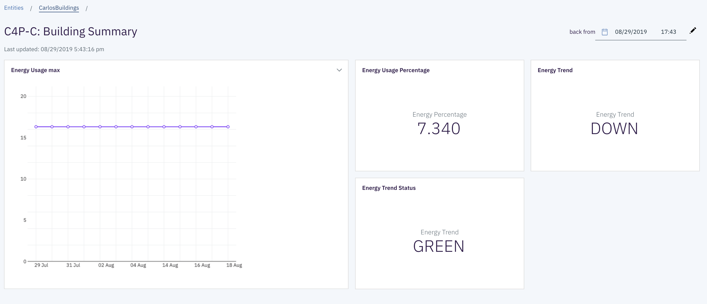


## 7. Update Function (Optional)

If you're interested in pulling data from additional / alternative data sources, you'll need to make a few changes to the `custom/functions.py` file, which drives the IoT Analytics logic.

In our case, we first added methods to query the Maximo api
```
def getBuildings (self ):
    q_endpoint = self.url + "/maximo/oslc/os/mxasset?oslc.select=assetid&oslc.where=assettag=" + "BUILDING"
    headers = { "maxauth": self.token }
    res = requests.get(q_endpoint, headers=headers)
    return buildings
```

```
def getMeters (self, asset_id = None):
    # hardcoding id for test TODO
    asset_id = "2112"
    q_endpoint = self.url + "/maximo/oslc/os/mxasset?oslc.select=assetmeter&oslc.where=assetnum=" + asset_id
    headers = { "maxauth": self.token }
    res = requests.get(q_endpoint, headers=headers)
    meters = []
    try:
        meters = res.json()["rdfs:member"][0]["spi:assetmeter"]
        print(str(len(meters)) + " meters found")
    except:
        print("no meters found")
        pass
    return meters
```
These methods query the Maximo OSLC api to receive all buildings and meters that are associated with an Asset derived from the "Building" template

Next, we added these custom methods to the main `execute` method. The result of each method is then loaded into a `response_data` dictionary as a numpy array.

```
buildings = self.getBuildings()
response_data['building'] = np.array(buildings)
..
..
meterValues = self.getMeters()
response_data['temperature'] = np.array(meterValues)
```

Finally, commit and push these changes to git, and rerun the `local_test_of_function.py` script to register the function changes
<!-- First, in the `init` function, we'll define parameters needed to authenticate to various apis.  -->

<!-- * Push function code changes to Github. -->
```
git add ./custom/functions.py
git commit -m "my function changes"
git push origin master
```
<!-- * Update function input arguments in your Buildings Entity Type (if applicable)
```
Explore > Entity Types > Buildings > output_item > configure > next > update
``` -->

<!-- 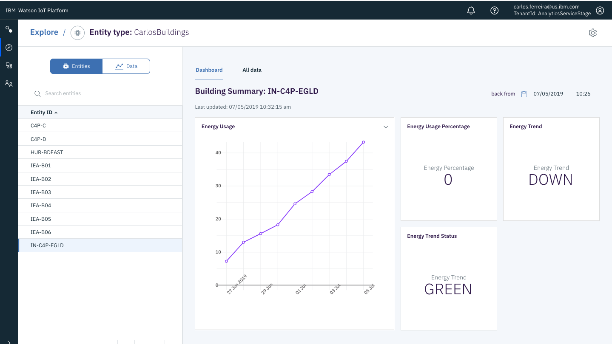 -->

# Learn more

* **Watson IOT Platform Code Patterns**: Enjoyed this Code Pattern? Check out our other [Watson IOT Platform Code Patterns](https://developer.ibm.com/?s=Watson+IOT+Platform).

* **Knowledge Center**:Understand how this Python function can load data into  [Watson IOT Platform Analytics](https://www.ibm.com/support/knowledgecenter/en/SSQP8H/iot/analytics/as_overview.html)

# License

This code pattern is licensed under the Apache Software License, Version 2.  Separate third party code objects invoked within this code pattern are licensed by their respective providers pursuant to their own separate licenses. Contributions are subject to the [Developer Certificate of Origin, Version 1.1 (DCO)](https://developercertificate.org/) and the [Apache Software License, Version 2](https://www.apache.org/licenses/LICENSE-2.0.txt).

[Apache Software License (ASL) FAQ](https://www.apache.org/foundation/license-faq.html#WhatDoesItMEAN)
